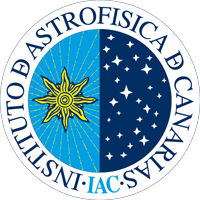
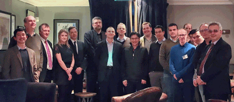

 

# Ground-breaking rapid robotic follow-up with a 4-metre successor to the Liverpool Telescope

Welcome to the new webpage for the Liverpool New Robotic Telescope; a collaboration between Liverpool John Moores University and the Instituto de Astrofísica de Canarias. The [design team](team.md), established in early 2018, are in the process of finalising the engineering and science requirements of the facility.

The [news](news.md) page details the latest project developments including workshops, meetings, partners and outreach.

As part of the Astrophysics Research Institute at LJMU, we are dedicated to pushing our [equity and diversity](ed.md) initiatives and creating a welcoming working environment and partnership. 

 
NRT Workshop group photo. Left to right: Marco Lam, Iain Steele, Robin Leatherbarrow, Abigail Lewis, Paulo Lisboa, Ian Baker, Adrian McGrath, Phil James, Suparerk Aukkaravittayapun, Chris Copperwheat, Saran Poshyachinda, Juan Cozar, Christophe Buisset, Helen Jermak, Thirasak Panyaphirawat, Apirat Prasit, Carlos M Gutierrez, Ahmed Al Shamma’a. Credit: Marco Lam.
