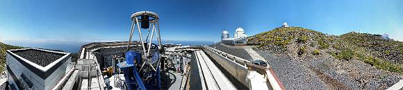

# Science Case

Building on the success of the fully autonomous and robotic Liverpool Telescope, the design of its 4 metre successor is underway. The focus is on fast follow-up of rapidly varying and fading transients, including gravitational wave candidates and new and exciting object which are anticipated to be discovered in the new upcoming era of survey telescopes. The next decade will see the commissioning of many major international projects, opening new windows on the time-variable universe. They will make it possible to search wider areas of the sky than ever before, and as such discover new classes of transient and time-variable sources at optical, radio and high-energy Gamma-ray wavelengths and using multimessenger and particle physics. There is a critical need for a new 4.0m optical follow-up facility to rapidly respond to such discoveries and make detailed photometric, spectroscopic and polarimetric observations.

The key science drivers are supernovae, gamma-ray bursts, electromagnetic counterparts to gravitational wave sources, exoplanets, Gaia sources, fast-radio bursts, and new and currently unknown sources that will be discovered. In particular the NRT will carry out 
* ultra-rapid (<30 seconds) spectroscopic and polarimetric follow-up of electromagnetic counterparts of gravitational wave (aLIGO/Virgo) and neutrino (IceCUBE/ANTARES) sources and new radio (e.g. LOFAR/SUPERB) and high energy (e.g. SVOM, Fermi, Einstein Probe) transients, 
* rapid (<1hr) spectroscopy and polarimetry of (e.g. LSST/ZTF) supernovae (SNe) to explore the shock-breakout phase and find spectral signatures of the progenitor, and of recurrent novae (the supposed progenitors of Type Ia SNe, 
* timely (<24 hours) and time resolved spectroscopy of the evolution of the previously mentioned sources, plus galactic transients such as outbursting binary X-ray transients and eruptive Young Stellar Objects (YSOs) detected by VISTA/Pan-STARRS/LSST, and iv) simultaneous spectroscopic and polarimetric montioring of sources such as blazars (e.g. with Fermi, CTA) and changing-look AGN.

The flagship of the next generation of sky surveys will be the Large Synoptic Sky Survey (LSST). The advantages of LSST are cadence and depth, meaning it will probe a new 'faint and fast' discovery regime. New northern hemisphere facilities such as Zwicky Transient Facility (ZTF) also offer sensitivity and field-of-view improvements over their predecessors, and will target this new regime. There is a critical need for follow-up capacity to provide the spectroscopic classifications and multiband light curves required for exploitation of the discoveries of the survey telescopes. Moreover, dedicated follow-up telescopes are required as the rate of targets-of-opportunity will be too high to rely on priority overrides on existing facilities (which would interriupt their existing science programmes). The PESSTO (Public ESO Spectroscopic Survey for Transient Objects) programme demonstrated the value of dedicating large amounts of telescope time to transient follow-up. In the new era, NTT/SOXS will fill this role in the Southern hemisphere, and NRT will be the ideal Northern counterpart. 

Robotic Telescopes like the NRT are uniquely suited to the task of transient follow-up since they can flexibly and automatically react to new discoveries in real time. They are quick to react to the most exciting targets: in the era of fast discovery, the follow-p must proceed with a similar alacrity. The LT is currently a world-leading facility for time-domain rapid response, but the sensitivity of the new discovery facilities will require a larger aperture facility; hence the need for the NRT.

If you want more information about the NRT Science Case, or are a potential user, please contact the NRT Project Scientist, Helen Jermak; <h.e.jermak@ljmu.ac.uk>.

