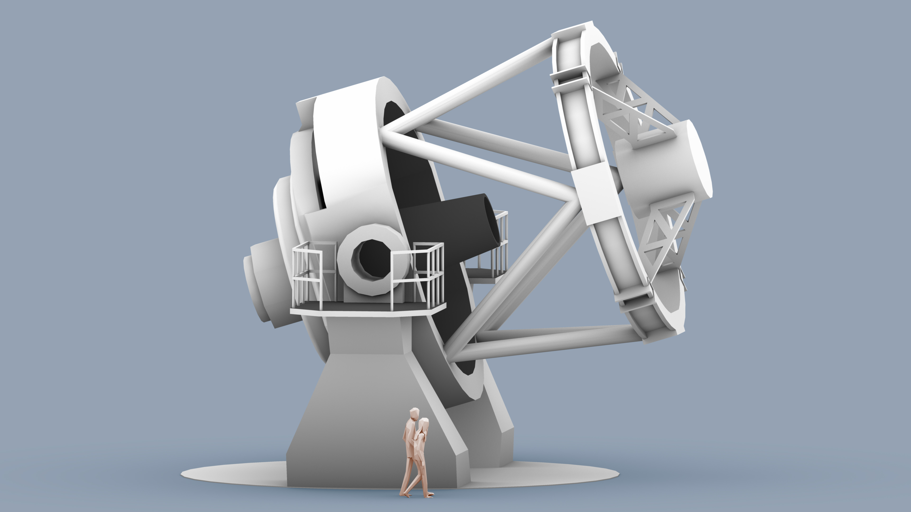

# A rapid response robotic telescope on La Palma

 

The New Robotic Telescope (NRT) will be co-located with the current Liverpool Telescope (LT) on the Canary Island of La Palma. The proposed site for construction is the disused Carlsberg Meridian Telescope site, close to the William Herschel Telescope (WHT). **move info from science case section about choice of location **

The NRT is designed for rapid follow-up of transient objects (see our Science Case for full details). The 4 metre diameter mirror allows the exploration of fainter sources and shorter exposure times (and thus increased cadence monitoring) of variable objects.

The baseline optical design that has been developed for the 4 metre facility is a Ritchey-Chrétien telescope with a 4 metre primary mirror of focal ratio = f7.5. The design uses an f1.75 primary mirror and a back focal distance of 2.5m; allowing sufficient optical path length to provide possible Nasmyth (along with Cassegrain) foci and to allow for the mechanics of the tube, mirror support and instrumentation.
