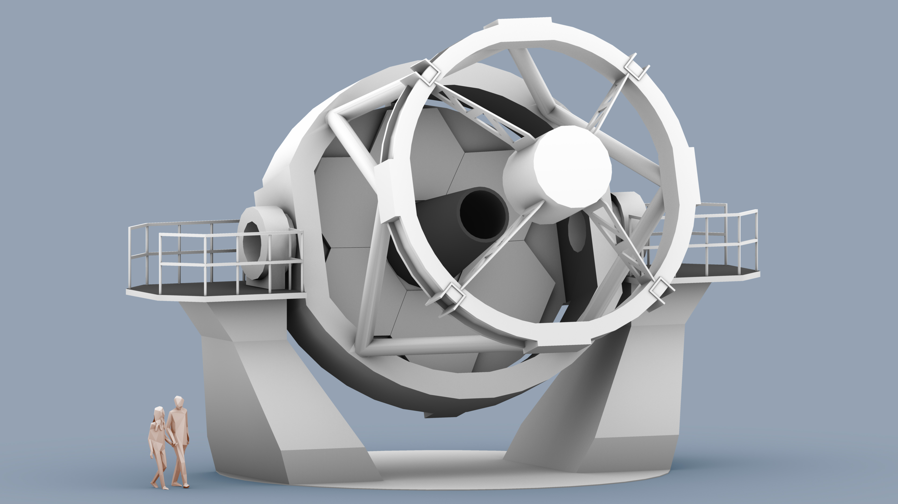

# A rapid response robotic telescope on La Palma

 

The New Robotic Telescope (NRT) is designed for rapid follow-up of transient objects (see our Science Case for full details). The baseline optical design that has been developed for the 4 metre facility is a Ritchey-Chrétien telescope with a focal ratio of f7.5. The design has developed using an f1.75 primary mirror and a back focal distance of 2.5m. This allows sufficient optical path length to provide possible Nasmyth foci and to allow for the mechanics of the tube, mirror support and instrumentation. This value will be optimised during the development of the concept design of the telescope tube as the tube balance evolves.

